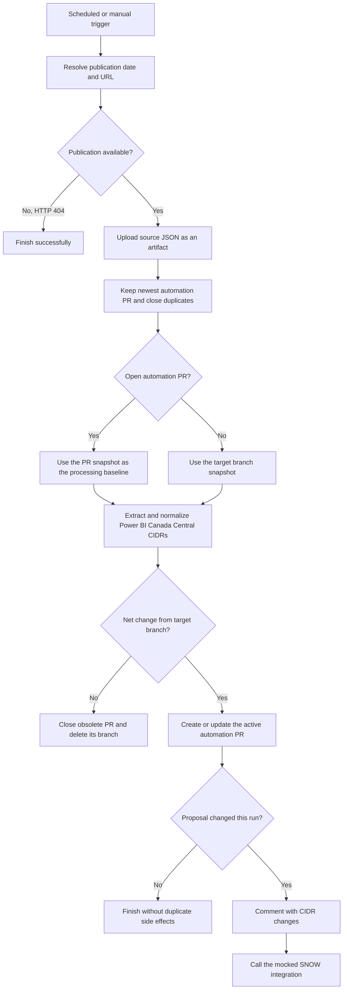

# IP Allow List Workflow POC

This repository maintains the IP allow-list changes for the
`PowerBI.CanadaCentral` Azure service tag.

## What the workflow does

The **IP Allow List Update** workflow keeps the repository's Power BI Canada
Central allow list in sync with Microsoft's Azure Public Service Tags feed.

It runs on a schedule (`cron: "17 */4 * * *"`, which is every four hours) and
can also be started manually through `workflow_dispatch`. In each run it:

1. Builds the Azure Service Tags URL using today's UTC date, or an optional
   `YYYYMMDD` date supplied for a manual run.
2. Downloads the source JSON and stores it as a build artifact for 30 days.
3. Extracts the `PowerBI.CanadaCentral` `addressPrefixes` values and normalizes
   them into a deterministic list of CIDRs.
4. Compares the live values with the committed snapshot in
   `data/powerbi-canadacentral-prefixes.json`.
5. Finds automation PRs for the target branch, keeps the newest one, and closes
   older duplicates.
6. Creates or updates one automation pull request when the set of CIDRs differs
   from the target branch. The PR includes the latest snapshot and an
   `ip-manage-actions.json` delta file.
7. Closes the active automation PR if the latest publication no longer differs
   from the target branch.
8. Posts a PR comment and calls the mocked SNOW integration only when a new
   non-empty delta updates the proposal.

Microsoft does not publish a Service Tags file every day. If the constructed URL
returns HTTP 404, the workflow finishes successfully without uploading an
artifact or running the processing and API jobs. Other download failures still
fail the workflow. A manually triggered run can use the optional `date` input to
target a specific publication; omitted inputs and scheduled runs use today's UTC
date.



The automation maintains at most one IP allow-list PR per target branch. New
proposals use a branch named
`automation/ip-allow-list-update-<target-branch>`. If matching PRs already
exist, the workflow retains the newest PR and closes older duplicates before
processing. It reuses the retained PR's head branch and snapshot, so each later
publication updates that PR instead of opening another one.

The `add`/`remove` entries always compare the latest publication against the
target branch, so the active PR shows the complete net change relative to the
merged result. Rerunning the same publication leaves the PR unchanged and does
not add another comment or SNOW entry. If a later publication reverts all
unmerged changes, the workflow restores the target state, closes the obsolete
PR, and deletes its automation branch.

The repository must allow GitHub Actions to create pull requests. If that
setting cannot be enabled, configure an `IP_ALLOW_LIST_PR_TOKEN` Actions secret
with repository contents and pull-request write access. The workflow uses that
secret when present and otherwise uses its scoped `GITHUB_TOKEN`.

## Supporting files

This repository is intentionally small and centered around a single automation
flow, with a few files providing the data and the execution logic.

- `.github/workflows/ip-allow-list-update.yml` - defines the scheduled/manual
  GitHub Actions pipeline and the approval/PR flow.
- `scripts/ip_allow_list.py` - Python entry point that downloads an Azure
  Service Tags URL, normalizes CIDRs, compares snapshots, writes the delta
  action file, and mocks the SNOW API call.
- `data/powerbi-canadacentral-prefixes.json` - the checked-in snapshot of the
  currently approved `PowerBI.CanadaCentral` CIDRs used as the source of truth for
  comparisons.
- `ip-manage-actions.json` - the generated delta for the latest update, with
  `actions.add` and `actions.remove` entries plus `dateUpdated`.
- `ServiceTags_Public_20260824.json` - a seed/downloaded sample file used to
  validate the workflow logic locally and to bootstrap the initial snapshot.
- `tests/test_ip_allow_list.py` - regression tests that validate downloads,
  CIDR extraction, snapshot comparison, and payload validation behavior.
- `tests/fixtures/` - sample service-tag payloads used by the tests.

## State and action documents

`data/powerbi-canadacentral-prefixes.json` is the authoritative prior-state
snapshot. It is seeded from `ServiceTags_Public_20260824.json` and stores the
complete normalized set of Canada Central Power BI CIDRs.

`ip-manage-actions.json` is a per-update delta rather than a complete allow list:

- `actions.add` contains CIDRs present in the latest publication but absent from
  the snapshot.
- `actions.remove` contains CIDRs present in the snapshot but absent from the
  latest publication.
- `dateUpdated` is the Azure publication date encoded in the source
  `ServiceTags_Public_YYYYMMDD.json` filename.

Both IPv4 and IPv6 CIDRs are preserved as networks and sorted deterministically.
The action document is generated, committed through the automation pull
request, and published as the `ip-manage-actions` artifact only when there is a
non-empty delta. The downloaded Service Tags export is not committed by the
workflow.

## SNOW mock

`scripts/ip_allow_list.py` exposes `create_snow_entry(payload)` as the integration
boundary for a future API client. The current implementation validates the
action payload and always returns a mocked success response without making a
network request.

## Local usage

Run the tests with:

```shell
python -m unittest discover -s tests -v
```

Process the included sample against the seeded snapshot:

```shell
python scripts/ip_allow_list.py process \
  --source ServiceTags_Public_20260824.json \
  --snapshot data/powerbi-canadacentral-prefixes.json \
  --actions ip-manage-actions.json \
  --summary ip-change-summary.md
```

Download a specific publication:

```shell
python scripts/ip_allow_list.py download \
  --download-url https://download.microsoft.com/download/7/1/d/71d86715-5596-4529-9b13-da13a5de5b63/ServiceTags_Public_20260824.json \
  --download-dir downloads
```
